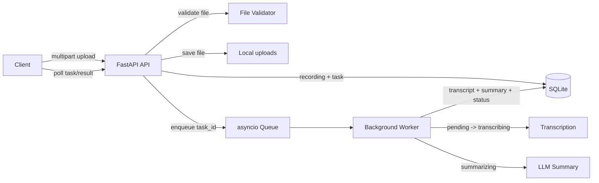

# 录音转写服务 API

一个面向录音处理场景的后端服务，支持音频上传、异步转写、智能摘要、任务查询、失败重试和录音管理。

## 项目结构

```text
笔试/
├── app/
│   ├── __init__.py
│   ├── config.py          # 环境变量与运行配置
│   ├── database.py        # SQLite 连接、事务、时间与 JSON 辅助函数
│   ├── errors.py          # 统一错误响应
│   ├── main.py            # FastAPI 入口与 HTTP 接口
│   ├── repository.py      # recordings / tasks 数据访问层
│   ├── schemas.py         # Pydantic 响应模型
│   └── services.py        # 转写、摘要、后台任务队列与状态机
├── migrations/
│   └── 001_init.sql       # SQLite 建表脚本
├── tests/
│   ├── test_repository.py # 幂等上传、失败任务 retry 测试
│   └── test_services.py   # 摘要结构与 todos 规则测试
├── .env.example           # 环境变量示例
├── .gitignore
├── README.md
├── README222.md           # 参考书写结构
├── requests.http          # API 调试文件
├── requirements.txt       # Python 依赖
├── run.ps1                # Windows 一键启动脚本
├── run.sh                 # macOS / Linux 一键启动脚本
└── 后端实习生笔试项目.pdf
```

运行后会自动生成：

```text
data/
├── app.db                 # SQLite 数据库文件
└── uploads/               # 上传的录音文件
```

## 环境要求

- Python 3.10+
- Windows / macOS / Linux 均可
- 不需要额外安装 PostgreSQL、MySQL、Redis 或对象存储


## 启动项目

### Windows 一键启动

PowerShell 终端：

```powershell
.\run.ps1
```

如果当前终端是 `cmd`，使用：

```cmd
powershell -ExecutionPolicy Bypass -File .\run.ps1
```

### macOS / Linux 一键启动

```bash
bash run.sh
```

### 手动启动

```bash
python -m uvicorn app.main:app --reload --host 0.0.0.0 --port 8000
```

启动成功后会看到类似：

```text
Uvicorn running on http://0.0.0.0:8000
Application startup complete.
```

本机访问地址：

```text
http://localhost:8000
```

FastAPI 接口文档：

```text
http://localhost:8000/docs
```

健康检查：

```text
http://localhost:8000/health
```

## API 调试

项目提供 [requests.http](./requests.http)，可在 VS Code REST Client 或 JetBrains HTTP Client 中直接运行。

核心接口：

- `POST /v1/recordings`：上传录音，表单字段名为 `file`
- `GET /v1/tasks/{task_id}`：查询任务状态
- `GET /v1/recordings?page=&page_size=`：分页查询录音列表
- `GET /v1/recordings/{id}`：查询录音详情
- `POST /v1/tasks/{task_id}/retry`：重试失败任务
- `DELETE /v1/recordings/{id}`：删除录音和本地文件

## 架构流程



## 任务流程与并发控制

任务状态机：

```text
pending -> transcribing -> summarizing -> done
                          \-> failed
```

处理流程：

```text
上传录音
-> 校验文件
-> 保存到本地磁盘
-> 创建 recording 记录
-> 创建 pending task
-> 立即返回 recording_id 和 task_id
-> 后台 worker 消费任务
-> 转写
-> 摘要
-> 写入 transcript / summary
-> 标记 done
```

失败处理：

- 任一阶段失败后自动重试
- 最多尝试 3 次
- 指数退避：1 秒、2 秒
- 重试耗尽后任务进入 `failed`
- 只有 `failed` 状态允许手动 retry
- 重复 retry 同一个失败任务会返回同一个重试任务

并发控制：

- 后台任务使用 `asyncio.Queue`
- 通过 `WORKER_CONCURRENCY` 控制同时处理的任务数
- 默认最多 3 个任务并发处理

服务重启恢复：

- 服务启动时扫描 `pending / transcribing / summarizing` 状态的未删除任务
- 扫描到的任务会重新入队
- 避免任务因为服务重启永久卡在处理中

## 摘要结果

录音详情接口在任务完成后返回：

```json
{
  "transcript": "录音转写文本",
  "summary": {
    "summary": "一句话摘要",
    "key_points": ["关键要点 1", "关键要点 2"],
    "todos": ["待办事项 1"]
  }
}
```

字段说明：

- `transcript`：录音转写文本
- `summary.summary`：根据 `transcript` 生成的一句话摘要
- `summary.key_points`：根据 `transcript` 提炼的关键要点
- `summary.todos`：根据 `transcript` 提取的待办事项

`todos` 规则：

- 有明确待办事项、后续动作、负责人安排或截止时间时，返回具体待办数组
- 没有明确待办事项时，返回空数组 `[]`
- 提示词要求模型不要编造待办事项

## 数据库说明

项目使用 SQLite。建表 SQL 位于 [migrations/001_init.sql](./migrations/001_init.sql)。

主要数据表：

- `recordings`：录音记录表
- `tasks`：处理任务表

`recordings` 主要字段：

- `id`：录音 ID，格式如 `rec_xxx`
- `original_filename`：原始文件名
- `stored_filename`：本地保存文件名
- `file_path`：本地文件路径
- `content_type`：上传文件 MIME 类型
- `extension`：文件扩展名
- `size_bytes`：文件大小
- `content_hash`：文件 SHA-256 哈希，用于同文件去重
- `transcript`：转写文本
- `summary_json`：摘要 JSON
- `idempotency_key`：客户端幂等键
- `created_at` / `updated_at` / `deleted_at`：时间字段

`tasks` 主要字段：

- `id`：任务 ID，格式如 `task_xxx`
- `recording_id`：关联录音 ID
- `status`：任务状态
- `attempt_count`：当前尝试次数
- `max_attempts`：最大尝试次数
- `error`：失败原因
- `retried_by_task_id`：该失败任务对应的重试任务 ID
- `created_at` / `updated_at` / `started_at` / `finished_at`：时间字段

表关系：

```text
recordings 1 ---- n tasks
```

列表接口会展示每条录音的最新任务状态。

## 错误响应

统一错误格式：

```json
{
  "error": {
    "code": "recording_not_found",
    "message": "recording not found"
  }
}
```

常见状态码：

- `400`：请求参数或文件不合法
- `404`：录音或任务不存在
- `409`：对非失败任务执行 retry
- `422`：FastAPI 参数校验失败

## 基本使用流程

1. 启动服务。
2. 打开 `http://localhost:8000/docs`。
3. 调用 `POST /v1/recordings` 上传录音文件。
4. 复制返回的 `task_id`。
5. 调用 `GET /v1/tasks/{task_id}` 查询任务状态。
6. 等待状态变为 `done`。
7. 复制返回的 `recording_id`。
8. 调用 `GET /v1/recordings/{recording_id}` 查看 `transcript` 和 `summary`。
9. 如需删除，调用 `DELETE /v1/recordings/{recording_id}`。

示例返回：

```json
{
  "recording_id": "rec_71f43d8a8dd7458d98a9e0cae5d9c461",
  "task_id": "task_9c7e228a118d41fd9e5050a6975042f3",
  "status": "pending"
}
```

## 测试

运行测试：

```bash
pytest
```

当前测试覆盖：

- 上传按文件哈希幂等
- 失败任务 retry 幂等
- 摘要结果结构
- 没有待办事项时 `todos` 返回 `[]`
- 有明确待办事项时 `todos` 返回待办数组

## 注意事项

- 上传接口只校验文件存在、大小和扩展名。
- 任务处理是异步的，上传成功后需要通过 `task_id` 查询状态。
- `retry` 接口只适用于 `failed` 状态任务。
- 删除录音会同时删除本地文件和关联数据。
- `0.0.0.0` 是服务监听地址，本机浏览器访问请使用 `localhost` 或 `127.0.0.1`。
